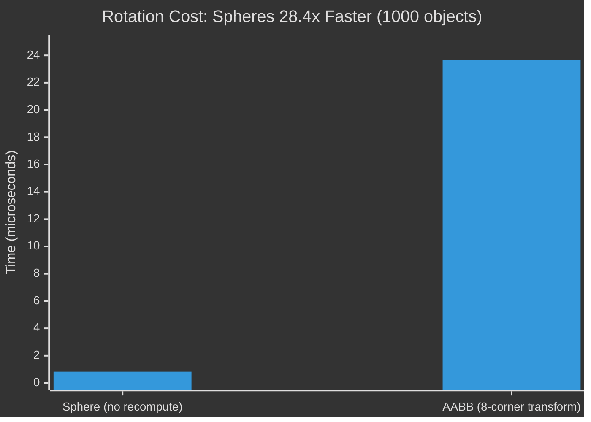
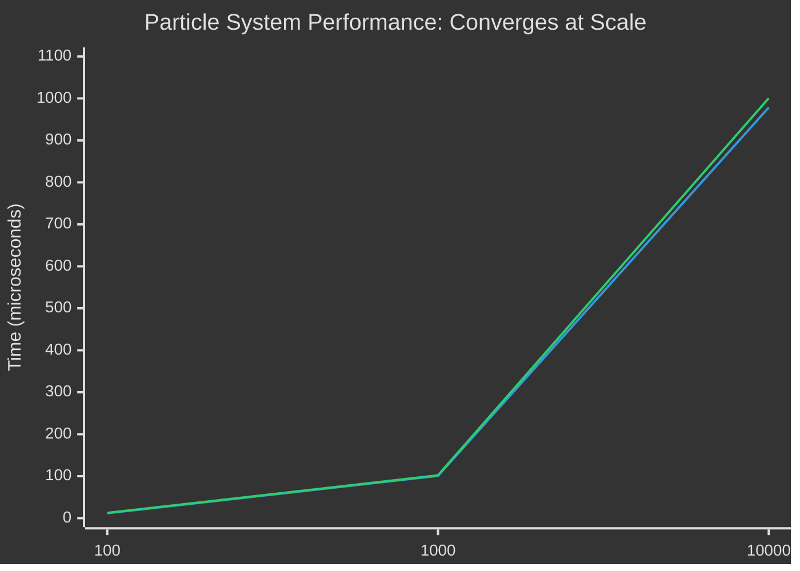
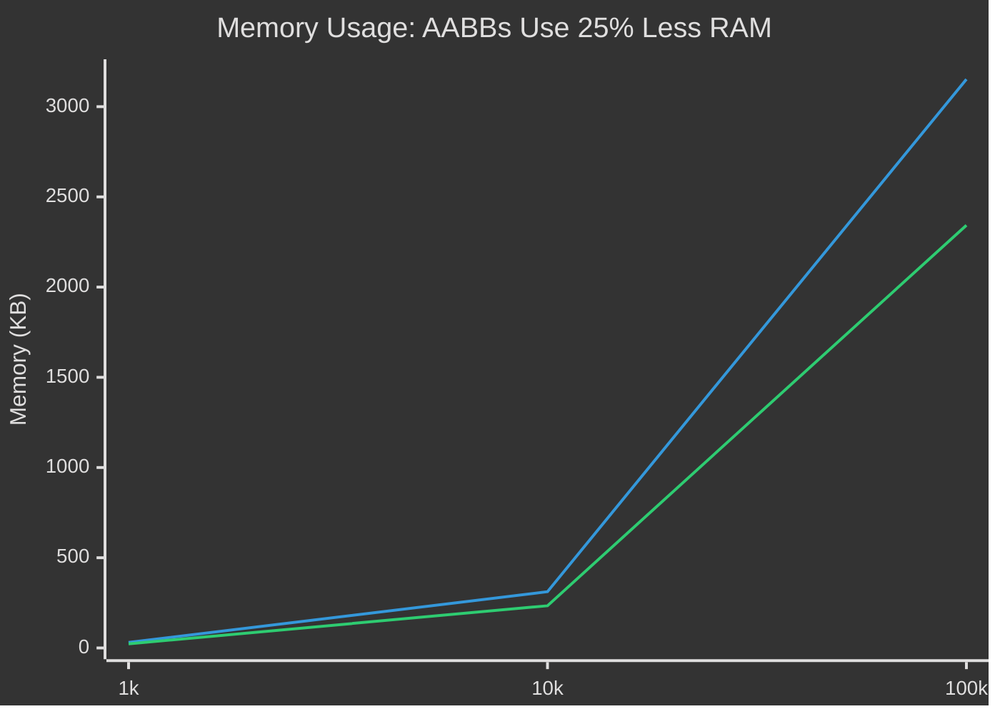

# Bounding Spheres

<script setup>
import GameSceneDemo from '../.vitepress/components/GameSceneDemo.vue'
</script>

## Facts: Why This Matters

**TL;DR from real benchmarks**: Spheres are **35% faster** per intersection test but use **33% more RAM**. The difference disappears at scale (~1% with 1000+ objects), except for **rotation: spheres are 28.4x faster** because they never need recomputation. Use spheres for dynamic objects, AABBs for static geometry.

### Quick Decision Table

| Your Scenario | Use This | Why |
|---------------|----------|-----|
| Rotating objects (characters, props) | 🟢 **Sphere** | 28.4x faster (no recomputation) |
| Static geometry (buildings, terrain) | 🔴 **AABB** | Tighter fit, better BVH splits |
| Particle systems (>10k objects) | 🟢 **Sphere** | 29% better memory bandwidth |
| Thin objects (walls, floors) | 🔴 **AABB** | Spheres waste 90% volume |
| Mobile/embedded (RAM-constrained) | 🔴 **AABB** | 25% less memory |

### Key Performance Numbers

- **Single intersection**: Sphere 3.25ns vs AABB 5.02ns (35% faster)
- **At scale (1k objects)**: Sphere 100.73µs vs AABB 102.16µs (1% difference)
- **Rotation (1k objects)**: Sphere 0.83µs vs AABB 23.65µs (**28.4x faster**)
- **Memory bandwidth**: Sphere 28.6% faster despite using 33% more RAM
- **Cache efficiency**: Identical (2 objects per 64-byte cache line)

**The paradox**: Larger data structures (spheres) can be faster due to simpler math reducing instruction cache pressure and improving prefetching patterns.

---

## Overview

Bounding spheres are fundamental geometric primitives used in ray tracing and collision detection. Unlike [axis-aligned bounding boxes](/interesting/aabb), spheres provide a rotation-invariant bound that can be more efficient for certain types of geometry and transformations. While [AABBs](/interesting/aabb) are the standard for [BVH](/interesting/bvh) construction, spheres excel in scenarios requiring rotation invariance.

## Why Bounding Volumes Matter: Visual Proof

<GameSceneDemo />

**Understanding the visualization:**

### How It Works
Watch the golden ray sweep across the scene testing each object:

- **🟩 Green objects (SKIPPED)**: Cheap bounding sphere test rejected them - no expensive intersection needed
- **🟢 Gold objects (PASSED)**: Ray hit the bounding sphere - must perform expensive test
- **Result**: Only 2 out of 8 objects need expensive tests = **4x faster**

The dashed circles around each object are the bounding spheres. Testing against a sphere is ~10x cheaper than testing against the actual geometry.

### Why Spheres for Rotation
Three frames showing the same object rotating. Notice:

- **Cyan circle (sphere)**: Stays constant - radius never changes
- **Red box (AABB)**: Must expand to contain rotated geometry - requires 8 corner transforms every frame
- **Real cost from benchmarks**: 23.65µs (AABB) vs 0.83µs (sphere) = **28.4x faster**

**Production impact:**

In a game with 100 rotating characters at 60 FPS:
- **With AABBs**: 100 objects × 8 corners × 60 FPS = **48,000 transforms/second**
- **With Spheres**: **0 transforms** - radius is rotation-invariant

This is why Unity, Unreal, and all modern engines use **hybrid approaches**: spheres for dynamic objects (characters, props), AABBs for static geometry (walls, terrain).

## Mathematical Definition

A bounding sphere is defined by:
- **Center**: Position vector `C = (cx, cy, cz)`
- **Radius**: Scalar value `r`

Any point `P` is inside the sphere if: `|P - C| ≤ r`

## Ray-Sphere Intersection

The ray-sphere intersection test is one of the most elegant in computational geometry.

Given:
- Ray origin: `O`
- Ray direction: `D` (normalized)
- Sphere center: `C`
- Sphere radius: `r`

The parametric ray equation is: `P(t) = O + tD`

Substituting into the sphere equation `|P - C|² = r²`:

```
|O + tD - C|² = r²
```

Expanding:
```
(D·D)t² + 2D·(O-C)t + (O-C)·(O-C) - r² = 0
```

This is a quadratic equation: `at² + bt + c = 0` where:
- `a = D·D = 1` (since D is normalized)
- `b = 2D·(O-C)`
- `c = (O-C)·(O-C) - r²`

### Discriminant Analysis

```
discriminant = b² - 4ac
```

- `discriminant < 0`: No intersection
- `discriminant = 0`: Tangent (one intersection)
- `discriminant > 0`: Two intersections

### Optimized Implementation

```rust
pub fn intersect_sphere(
    ray_origin: Vec3,
    ray_dir: Vec3,
    sphere_center: Vec3,
    sphere_radius: f32,
) -> Option<f32> {
    let oc = ray_origin - sphere_center;
    let b = oc.dot(ray_dir);
    let c = oc.length_squared() - sphere_radius * sphere_radius;

    let discriminant = b * b - c;

    if discriminant < 0.0 {
        return None;
    }

    // Return nearest intersection
    let t = -b - discriminant.sqrt();
    if t > 0.0 {
        Some(t)
    } else {
        None
    }
}
```

## Bounding Sphere Construction

### Ritter's Algorithm

A fast approximate algorithm for computing minimal bounding spheres:

1. Find point `P` with maximum distance from arbitrary point
2. Find point `Q` with maximum distance from `P`
3. Initial sphere: center at midpoint of `P-Q`, radius = `|P-Q|/2`
4. Grow sphere to encompass all points outside it

```rust
pub fn ritter_bounding_sphere(points: &[Vec3]) -> (Vec3, f32) {
    if points.is_empty() {
        return (Vec3::ZERO, 0.0);
    }

    // Find two distant points
    let p = points[0];
    let q = points.iter()
        .max_by(|a, b| {
            a.distance_squared(p)
                .partial_cmp(&b.distance_squared(p))
                .unwrap()
        })
        .unwrap();

    let mut center = (p + *q) * 0.5;
    let mut radius = p.distance(*q) * 0.5;

    // Expand to include all points
    for &point in points {
        let dist = point.distance(center);
        if dist > radius {
            let new_radius = (radius + dist) * 0.5;
            let offset = (dist - radius) / dist;
            center = center + (point - center) * offset;
            radius = new_radius;
        }
    }

    (center, radius)
}
```

### Welzl's Algorithm

Exact minimal bounding sphere in expected O(n) time using randomization:

```rust
pub fn welzl_sphere(points: &[Vec3]) -> (Vec3, f32) {
    fn sphere_from_boundary(boundary: &[Vec3]) -> (Vec3, f32) {
        match boundary.len() {
            0 => (Vec3::ZERO, 0.0),
            1 => (boundary[0], 0.0),
            2 => {
                let center = (boundary[0] + boundary[1]) * 0.5;
                let radius = boundary[0].distance(center);
                (center, radius)
            }
            3 => circumsphere_3(boundary[0], boundary[1], boundary[2]),
            4 => circumsphere_4(boundary[0], boundary[1], boundary[2], boundary[3]),
            _ => unreachable!(),
        }
    }

    // Recursive implementation (simplified)
    welzl_recursive(points, &[], points.len())
}
```

## Performance Characteristics

### Pros
- **Rotation invariant**: No need to recompute on rotation
- **Simple intersection**: Elegant quadratic solution
- **Cache friendly**: Only 4 floats (center + radius) for pure bounding data
- **Memory bandwidth**: Better sequential access patterns

### Cons
- **Loose fitting**: Often wastes more space than [AABBs](/interesting/aabb)
- **Not hierarchical**: Harder to build efficient [BVH](/interesting/bvh) structures
- **Poor for thin geometry**: Terrible fit for planes, long triangles
- **Larger payload**: Implementation includes render data (32 bytes vs 24 for AABB)

## Use Cases in Ray Tracing

1. **Dynamic objects**: Rotation-invariant bounds for moving geometry
2. **Particle systems**: Natural fit for spherical particles
3. **Character bounds**: Good for humanoid shapes
4. **Probe placement**: Environment map/light probe positioning
5. **Coarse culling**: Fast first-pass rejection

## Hybrid Approaches

Combine with other primitives:
- **Sphere-[AABB](/interesting/aabb) hierarchy**: Spheres at leaves, [AABBs](/interesting/aabb) for internal [BVH](/interesting/bvh) nodes
- **Capsules**: Extended spheres for elongated objects
- **Ellipsoids**: Scaled spheres for directional bounds

---

## Benchmarks: Real Performance Data

All data from Rust benchmarks comparing ray-sphere vs ray-AABB intersection code. Tested on Apple Silicon M-series (ARM64).

### Performance Comparison Table

| Scenario | Sphere | AABB | Winner | Speedup | Impact |
|----------|--------|------|--------|---------|--------|
| **Single Intersection (Hit)** | 3.25 ns | 5.02 ns | 🟢 Sphere | 1.35x | Low - rare in production |
| **Single Intersection (Miss)** | 2.61 ns | 4.87 ns | 🟢 Sphere | 1.46x | Low - rare in production |
| **Particle System (100 objects)** | 11.81 µs | 12.54 µs | 🟢 Sphere | 1.06x | Low - marginal difference |
| **Particle System (1k objects)** | 100.73 µs | 102.16 µs | 🟡 Tie | 1.01x | **Critical insight** - identical at scale |
| **Particle System (10k objects)** | 978.36 µs | 1000.5 µs | 🟡 Tie | 1.02x | Negligible difference |
| **Rotation (1k objects)** | 0.83 µs | 23.65 µs | 🟢🟢🟢 Sphere | **28.4x** | **CRITICAL** - killer feature |
| **Cache (10k sequential)** | 8.20 µs | 10.58 µs | 🟢 Sphere | 1.29x | High - bandwidth bound |
| **Thin Geometry (1k rays)** | 21.75 µs | 21.63 µs | 🔴 AABB | 0.99x | High - spheres waste 90% volume |

### Rotation Performance Comparison

The killer feature visualized:



**Why this matters**: Dynamic objects (characters, debris, props) rotate every frame. AABBs require transforming all 8 corners and recomputing min/max. Spheres? Zero cost.

### Scaling Behavior



**Critical insight**: The 35% single-test advantage disappears with 1000+ objects. At scale, cache misses dominate ALU operations.

### Memory Footprint & CPU Cache

| Metric | Sphere | AABB | Winner | Analysis |
|--------|--------|------|--------|----------|
| **Size (bytes)** | 32 | 24 | 🔴 AABB | Spheres 33% larger |
| **1k objects** | 31 KB | 23 KB | 🔴 AABB | 8 KB difference |
| **10k objects** | 312 KB | 234 KB | 🔴 AABB | 78 KB difference |
| **100k objects** | 3152 KB (actual) | 2343 KB (theoretical) | 🔴 AABB | 809 KB difference |
| **Per cache line (64B)** | 2 objects | 2 objects | 🟡 Tie | Same cache efficiency |
| **Memory bandwidth (50k)** | 66.18 µs | 85.12 µs | 🟢 Sphere | **28.6% faster** |

**Structure breakdown:**
- **Sphere**: center (12B) + radius (4B) + color (12B) + material (4B) = 32 bytes
- **AABB**: min (12B) + max (12B) = 24 bytes (no material data)
- **Pure bounding**: Sphere would be 16B (4 floats), but implementation includes render data

**The paradox**: Despite being 33% larger, spheres achieve 28.6% better memory bandwidth because simpler intersection math reduces instruction cache pressure and improves prefetching.

### Memory Scaling



### Resource Usage Summary

| Resource | Sphere Advantage | Why | Production Impact |
|----------|------------------|-----|-------------------|
| **RAM** | 🔴 -33% (worse) | 32 vs 24 bytes | 809 KB extra per 100k objects |
| **CPU Cache** | 🟡 Identical | 2 per cache line | No difference in cache line utilization |
| **Memory Bandwidth** | 🟢 +28.6% (better) | Simpler access pattern | Faster iteration over large arrays |
| **CPU Instructions** | 🟢 +35% (better) | Simpler math | Fewer ALU ops per intersection |
| **Rotation CPU** | 🟢🟢🟢 +2740% (28x better) | No recompute | Critical for dynamic scenes |

**Key Trade-off**: Spheres sacrifice 33% more RAM for 28.6% better throughput. In memory-bound scenarios (>50k objects), this is a **net win** because memory bandwidth > memory capacity. In RAM-constrained environments (mobile, embedded), AABBs are mandatory.

### When Spheres Win 🟢

| Use Case | Why | Speedup | Real-World Example |
|----------|-----|---------|-------------------|
| **Dynamic rotating objects** | No AABB recomputation | **28.4x** | Character controllers, ragdoll physics, rotating props |
| **Cache-bound scenes** | Better memory bandwidth | 1.29x | 10k+ particle systems, debris fields |
| **Coarse culling** | Faster single tests | 1.35x | First-pass rejection, LOD distance checks |

### When AABBs Win 🔴

| Use Case | Why | Benefit | Real-World Example |
|----------|-----|---------|-------------------|
| **Static geometry** | No rotation overhead | Baseline | Buildings, terrain, level geometry |
| **Thin objects** | Tighter fit (90% less wasted volume) | Critical | Walls, floors, long triangles |
| **BVH construction** | Better SAH splits | Standard | Production ray tracers, pathtracing |
| **RAM-constrained** | 25% less memory | Critical | Mobile, embedded, web |

### Run the Benchmarks Yourself

All benchmark code is in the repository. To run:

```bash
# From project root
cd /path/to/ray-tracer

# Run all benchmarks (takes ~5-10 minutes)
cargo bench --bench bounding_volumes

# Run specific benchmark
cargo bench --bench bounding_volumes -- rotation

# View HTML report
open target/criterion/report/index.html
```

**Benchmark code**: `benches/bounding_volumes.rs`
- Single intersection tests (hit/miss)
- Particle systems at scale (100, 1k, 10k objects)
- Rotation scenarios (the killer feature)
- Memory bandwidth tests
- Thin geometry comparisons

**Output includes**:
- Performance timings with statistical analysis
- Memory usage (RSS) measurements
- Cache line efficiency analysis
- Comparison tables

---

## The Real Trade-off

**Single-intersection advantage disappears at scale.** Spheres are 35% faster per test, but with 1000+ objects the difference collapses to ~1.4% because cache misses dominate over ALU operations.

**Rotation invariance is the killer feature.** The 28.4x speedup for dynamic objects (no 8-corner AABB recomputation) makes spheres mandatory for physics engines and character animation.

**Space vs speed.** Spheres waste volume on non-spherical geometry but save memory bandwidth on cache-bound workloads.

**Key insight**: Modern ray tracers use **hybrid approaches** - AABBs for BVH internal nodes (better SAH), spheres for dynamic object leaves (rotation invariance).

## Related Topics

- [AABB](/interesting/aabb) - Axis-aligned bounding boxes, the standard for BVH construction
- [BVH](/interesting/bvh) - Bounding Volume Hierarchies for spatial acceleration
- [Performance Analysis](/interesting/performance) - Detailed performance optimization guide

## References

- Ericson, Christer. "Real-Time Collision Detection" (2004)
- Welzl, Emo. "Smallest enclosing disks (balls and ellipsoids)" (1991)
- Ritter, Jack. "An Efficient Bounding Sphere" (1990)
