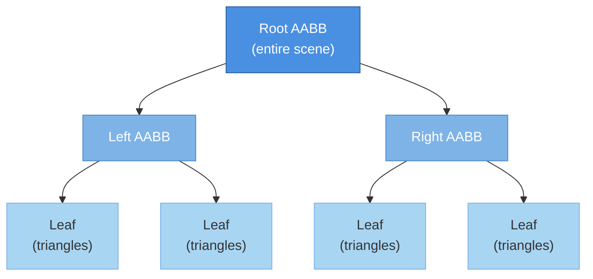

# BVH (Bounding Volume Hierarchies)

## Overview

Bounding Volume Hierarchies are the dominant acceleration structure in modern ray tracing. By organizing primitives into a tree of [AABBs](/interesting/aabb), BVHs reduce ray-primitive intersection tests from O(n) to O(log n), enabling real-time path tracing.

## Core Concept

A BVH is a binary tree where:
- **Leaf nodes**: Contain actual primitives (triangles, spheres, etc.)
- **Internal nodes**: Contain [AABBs](/interesting/aabb) that bound all descendants
- **Invariant**: Every child's AABB is contained in parent's AABB



## Data Structure

### Compact Node Layout

```rust
#[repr(C)]
#[derive(Clone, Copy)]
pub struct BVHNode {
    pub bounds: AABB,           // 24 bytes (6 floats)
    pub left_first: u32,        // Left child index OR first primitive index
    pub count: u32,             // 0 for interior, N for leaf with N primitives
}

impl BVHNode {
    pub fn is_leaf(&self) -> bool {
        self.count > 0
    }

    pub fn left_child(&self) -> u32 {
        debug_assert!(!self.is_leaf());
        self.left_first
    }

    pub fn right_child(&self) -> u32 {
        debug_assert!(!self.is_leaf());
        self.left_first + 1
    }

    pub fn first_primitive(&self) -> u32 {
        debug_assert!(self.is_leaf());
        self.left_first
    }

    pub fn primitive_count(&self) -> u32 {
        self.count
    }
}
```

### BVH Structure

```rust
pub struct BVH {
    pub nodes: Vec<BVHNode>,
    pub primitive_indices: Vec<u32>,  // Reordered primitive indices
}
```

## Construction Algorithms

### 1. Top-Down (Recursive)

The standard approach using :

```rust
pub fn build_bvh_recursive(
    primitives: &mut [Primitive],
    indices: &mut [u32],
    nodes: &mut Vec<BVHNode>,
) -> u32 {
    let node_idx = nodes.len() as u32;
    nodes.push(BVHNode::default());

    // Compute bounds
    let bounds = compute_bounds(primitives, indices);

    // Leaf condition
    if indices.len() <= 4 {
        nodes[node_idx as usize] = BVHNode {
            bounds,
            left_first: indices[0],
            count: indices.len() as u32,
        };
        return node_idx;
    }

    // Find best split using SAH
    let (split_axis, split_pos) = find_best_split(primitives, indices, &bounds);

    // Partition primitives
    let mid = partition(primitives, indices, split_axis, split_pos);

    // Recursively build children
    let left = build_bvh_recursive(primitives, &mut indices[..mid], nodes);
    let right = build_bvh_recursive(primitives, &mut indices[mid..], nodes);

    nodes[node_idx as usize] = BVHNode {
        bounds,
        left_first: left,
        count: 0,  // Interior node
    };

    node_idx
}
```

### 2. Surface Area Heuristic (SAH)

Optimal split finding:

```rust
pub fn find_best_split(
    primitives: &[Primitive],
    indices: &[u32],
    parent_bounds: &AABB,
) -> (usize, f32) {
    const NUM_BINS: usize = 16;
    let mut best_axis = 0;
    let mut best_pos = 0.0;
    let mut best_cost = f32::INFINITY;

    for axis in 0..3 {
        let extent = parent_bounds.extent()[axis];
        let min = parent_bounds.min[axis];

        // Initialize bins
        let mut bins = [Bin::default(); NUM_BINS];

        // Bin primitives
        for &idx in indices {
            let centroid = primitives[idx as usize].centroid();
            let bin_idx = ((centroid[axis] - min) / extent * NUM_BINS as f32) as usize;
            let bin_idx = bin_idx.min(NUM_BINS - 1);

            bins[bin_idx].count += 1;
            bins[bin_idx].bounds = bins[bin_idx].bounds.union(&primitives[idx as usize].bounds());
        }

        // Evaluate splits
        for i in 1..NUM_BINS {
            let (left_bounds, left_count) = bins[..i].iter()
                .fold((AABB::empty(), 0), |(b, c), bin| {
                    (b.union(&bin.bounds), c + bin.count)
                });

            let (right_bounds, right_count) = bins[i..].iter()
                .fold((AABB::empty(), 0), |(b, c), bin| {
                    (b.union(&bin.bounds), c + bin.count)
                });

            let cost = evaluate_sah(&left_bounds, left_count, &right_bounds, right_count);

            if cost < best_cost {
                best_cost = cost;
                best_axis = axis;
                best_pos = min + extent * (i as f32 / NUM_BINS as f32);
            }
        }
    }

    (best_axis, best_pos)
}

#[derive(Clone, Copy, Default)]
struct Bin {
    bounds: AABB,
    count: usize,
}
```

### 3. SBVH (Spatial Splits)

For overlapping geometry, spatial splits can improve quality:

```rust
pub enum SplitType {
    Object { axis: usize, pos: f32 },
    Spatial { axis: usize, pos: f32 },
}

pub fn find_best_split_sbvh(
    primitives: &[Primitive],
    indices: &[u32],
) -> SplitType {
    let object_split = find_best_object_split(primitives, indices);
    let spatial_split = find_best_spatial_split(primitives, indices);

    // Choose split with lowest cost
    if spatial_split.cost < object_split.cost * 0.9 {
        SplitType::Spatial {
            axis: spatial_split.axis,
            pos: spatial_split.pos
        }
    } else {
        SplitType::Object {
            axis: object_split.axis,
            pos: object_split.pos
        }
    }
}
```

## Traversal

### Stack-Based Traversal

```rust
pub fn traverse_bvh(
    bvh: &BVH,
    ray: &Ray,
    primitives: &[Primitive],
) -> Option<Hit> {
    let mut stack = [0u32; 64];
    let mut stack_ptr = 0;
    let mut current = 0u32;  // Root node
    let mut closest_hit: Option<Hit> = None;
    let mut t_max = f32::INFINITY;

    loop {
        let node = &bvh.nodes[current as usize];

        if node.is_leaf() {
            // Test primitives in leaf
            for i in 0..node.primitive_count() {
                let prim_idx = bvh.primitive_indices[(node.first_primitive() + i) as usize];
                if let Some(hit) = primitives[prim_idx as usize].intersect(ray, t_max) {
                    t_max = hit.t;
                    closest_hit = Some(hit);
                }
            }

            // Pop from stack
            if stack_ptr == 0 {
                break;
            }
            stack_ptr -= 1;
            current = stack[stack_ptr];
        } else {
            // Interior node - test both children
            let left = node.left_child();
            let right = node.right_child();

            let left_node = &bvh.nodes[left as usize];
            let right_node = &bvh.nodes[right as usize];

            let hit_left = left_node.bounds.intersect(ray, t_max);
            let hit_right = right_node.bounds.intersect(ray, t_max);

            match (hit_left, hit_right) {
                (true, true) => {
                    // Hit both - traverse nearest first
                    let dist_left = left_node.bounds.centroid().distance_squared(ray.origin);
                    let dist_right = right_node.bounds.centroid().distance_squared(ray.origin);

                    if dist_left < dist_right {
                        stack[stack_ptr] = right;
                        stack_ptr += 1;
                        current = left;
                    } else {
                        stack[stack_ptr] = left;
                        stack_ptr += 1;
                        current = right;
                    }
                }
                (true, false) => current = left,
                (false, true) => current = right,
                (false, false) => {
                    // Pop from stack
                    if stack_ptr == 0 {
                        break;
                    }
                    stack_ptr -= 1;
                    current = stack[stack_ptr];
                }
            }
        }
    }

    closest_hit
}
```

### Stackless Traversal (Rope BVH)

Using parent pointers for constant memory:

```rust
pub struct RopeBVHNode {
    pub bounds: AABB,
    pub left_first: u32,
    pub count: u32,
    pub parent: u32,     // Parent index
    pub sibling: u32,    // Sibling index (rope)
}
```

## Advanced Techniques

### 1. TLAS/BLAS (Two-Level BVH)

For dynamic scenes:

```rust
pub struct TLAS {
    pub nodes: Vec<BVHNode>,      // Top-level acceleration structure
    pub instances: Vec<Instance>,
}

pub struct BLAS {
    pub nodes: Vec<BVHNode>,      // Bottom-level (per-object)
    pub primitives: Vec<Triangle>,
}

pub struct Instance {
    pub blas_index: u32,
    pub transform: Mat4,
    pub inv_transform: Mat4,
}
```

### 2. Compressed BVH

For GPU memory efficiency:

```rust
#[repr(C)]
pub struct CompressedBVHNode {
    pub min: [u16; 3],      // Quantized min (6 bytes)
    pub max: [u16; 3],      // Quantized max (6 bytes)
    pub left_first: u32,    // 4 bytes
    pub count: u32,         // 4 bytes
}  // Total: 20 bytes vs 32 bytes
```

### 3. QBVH (Quad BVH)

4-way branching for better SIMD utilization:

```rust
pub struct QBVHNode {
    pub bounds: [AABB; 4],      // 4 children AABBs
    pub children: [u32; 4],      // Child indices
    pub counts: [u32; 4],        // Primitive counts or 0 for interior
}

// Can test all 4 children with single SIMD operation
```

## Performance Characteristics

| Metric | Value |
|--------|-------|
| Construction | O(n log n) with SAH |
| Traversal | O(log n) average |
| Memory | 2N - 1 nodes for N primitives |
| Build time | ~0.5-2ms per 10k triangles |

## Optimization Tips

1. **Bin count**: 16-32 bins for SAH is sweet spot
2. **Leaf size**: 4-8 primitives per leaf optimal
3. **Early termination**: Stop when SAH cost > primitive count
4. **Prefetch**: Prefetch child nodes during traversal
5. **SIMD**: Use [SIMD AABB intersection](/interesting/aabb) for 4-wide tests

## Use Cases

- **Static geometry**: Pre-built BVH, optimal quality
- **Dynamic scenes**: Rebuild or refit per frame
- **Instancing**:  with transforms
- **GPU ray tracing**: Hardware-accelerated BVH traversal
- **Path tracing**: Critical for interactive performance

## Related Topics

- [AABB](/interesting/aabb) - Bounding volumes used in BVH nodes
-  - Surface Area Heuristic for optimal construction
- [Bounding Spheres](/interesting/bounding-spheres) - Alternative bounding primitive
-  - Two-level hierarchies for instancing
-  - Spatial splits for overlapping geometry

## References

- Wald, Ingo. "On fast Construction of SAH-based Bounding Volume Hierarchies" (2007)
- Stich et al. "Spatial Splits in Bounding Volume Hierarchies" (2009)
- Nvidia OptiX documentation (2023)
- Pharr et al. "Physically Based Rendering" 4th Ed. (2023)
