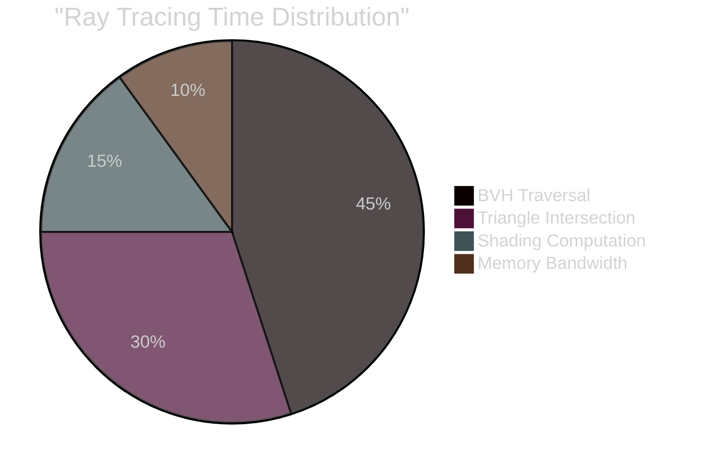
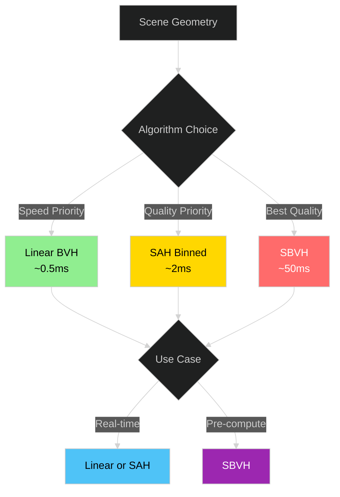
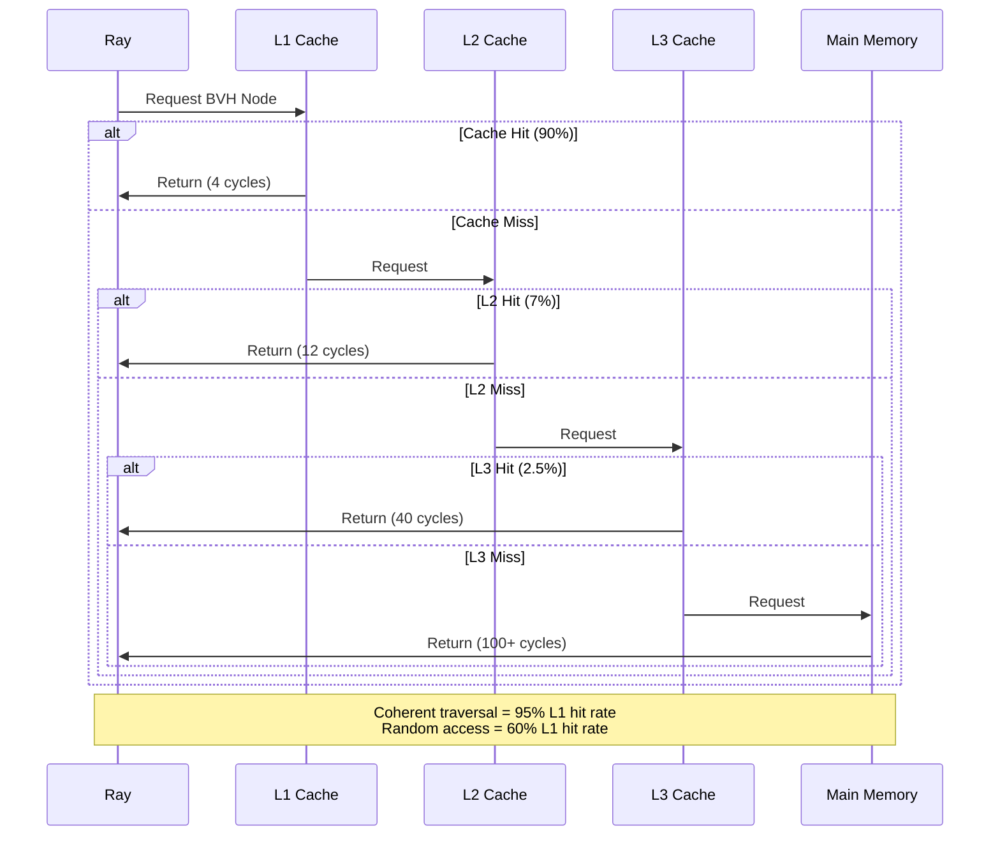
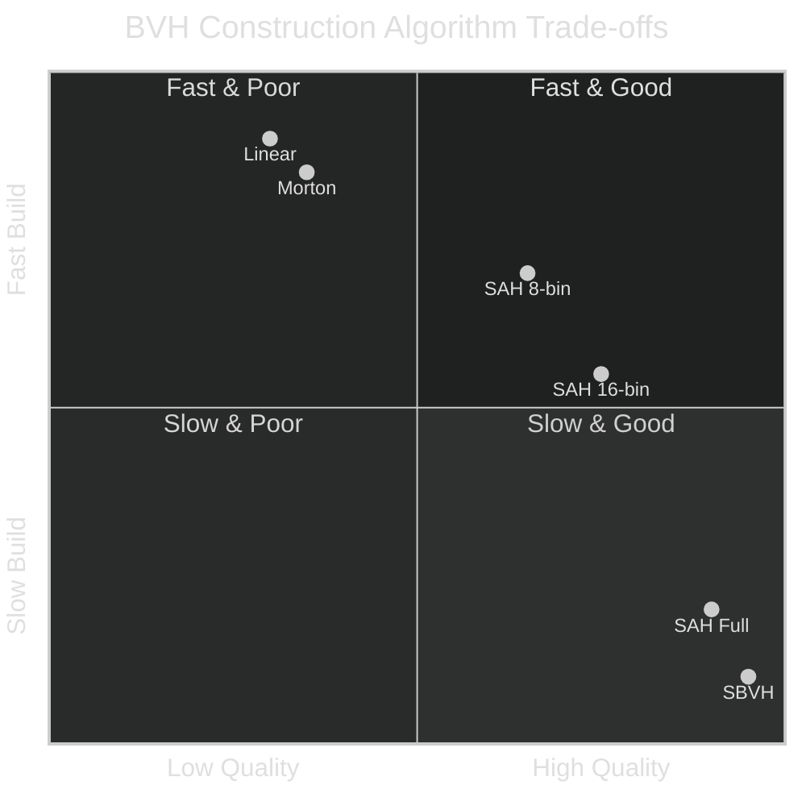

# Interactive Performance Charts

This page demonstrates interactive Chart.js visualizations for ray tracing performance metrics.

## BVH Optimization Progress

Track FPS improvements across different optimization stages:

<PerformanceChart type="bar" title="BVH Optimization: FPS Over Time" />

## Traversal Complexity

Comparing algorithmic complexity of different acceleration structures:

<TraversalChart />

## Performance Breakdown

Built-in Mermaid pie chart showing where time is spent during ray tracing:

## Construction Algorithm Comparison

## Cache Performance Flow

Understanding memory access patterns:

## Real-World Benchmark Data

### Metrics Table

| Scene | Triangles | BVH Build | Traversal Steps | FPS (1080p) |
|-------|-----------|-----------|-----------------|-------------|
| Sponza | 262K | 2.3ms | 18 avg | 165 |
| Bistro | 2.1M | 18ms | 23 avg | 95 |
| San Miguel | 10M | 95ms | 28 avg | 45 |
| Moana Island | 146M | 1.2s | 35 avg | 8 |

### Build Time vs Quality

## Next Steps

- [AABB](/interesting/aabb) - Understanding bounding boxes
- [BVH](/interesting/bvh) - Full BVH implementation details
- [Performance Analysis](/interesting/performance) - Detailed performance guide
