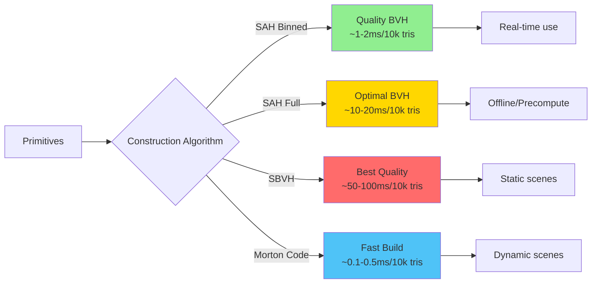
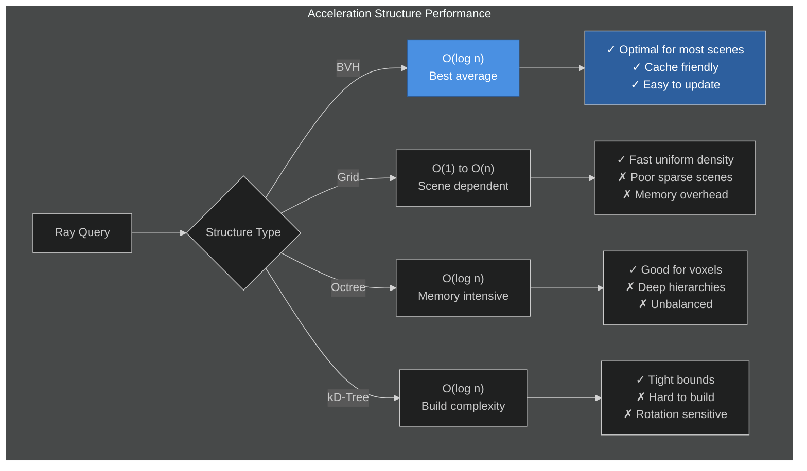
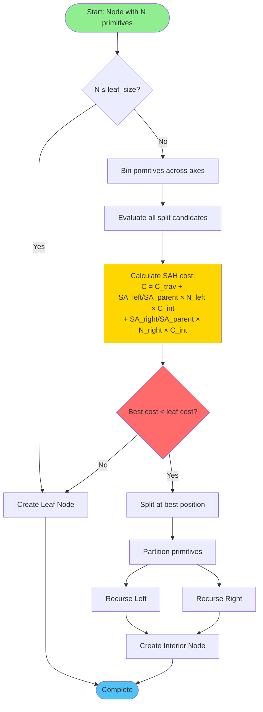
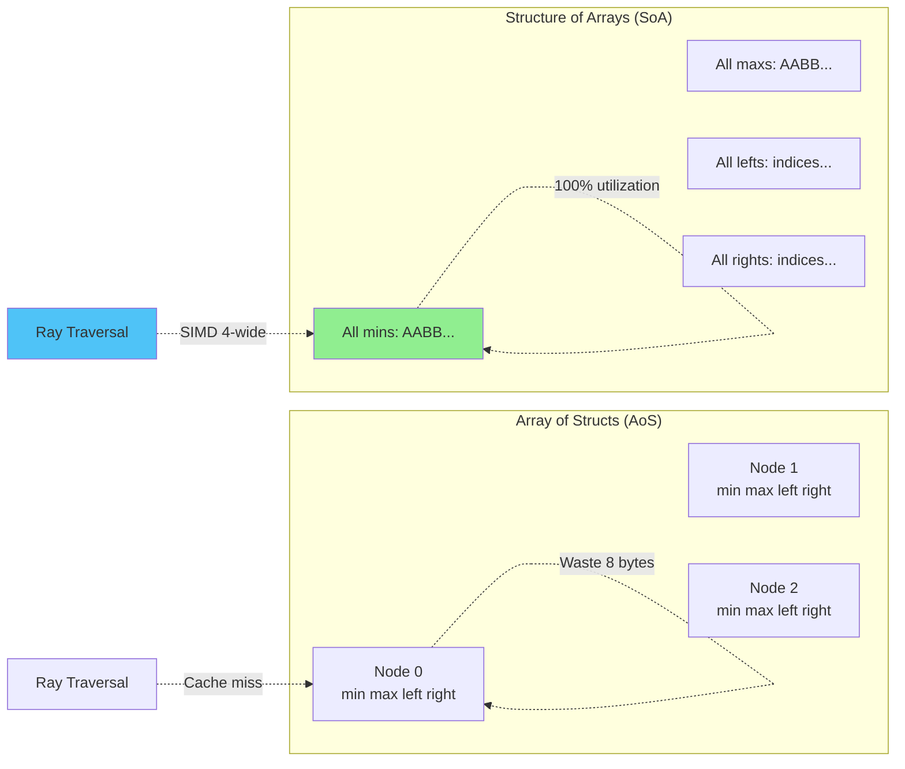
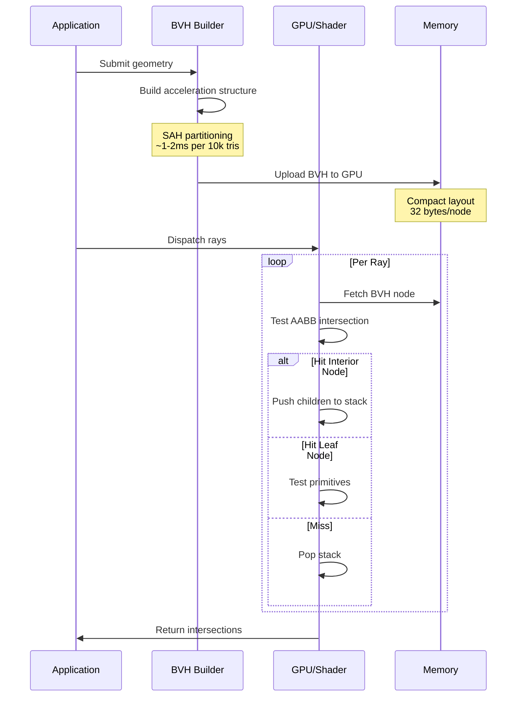
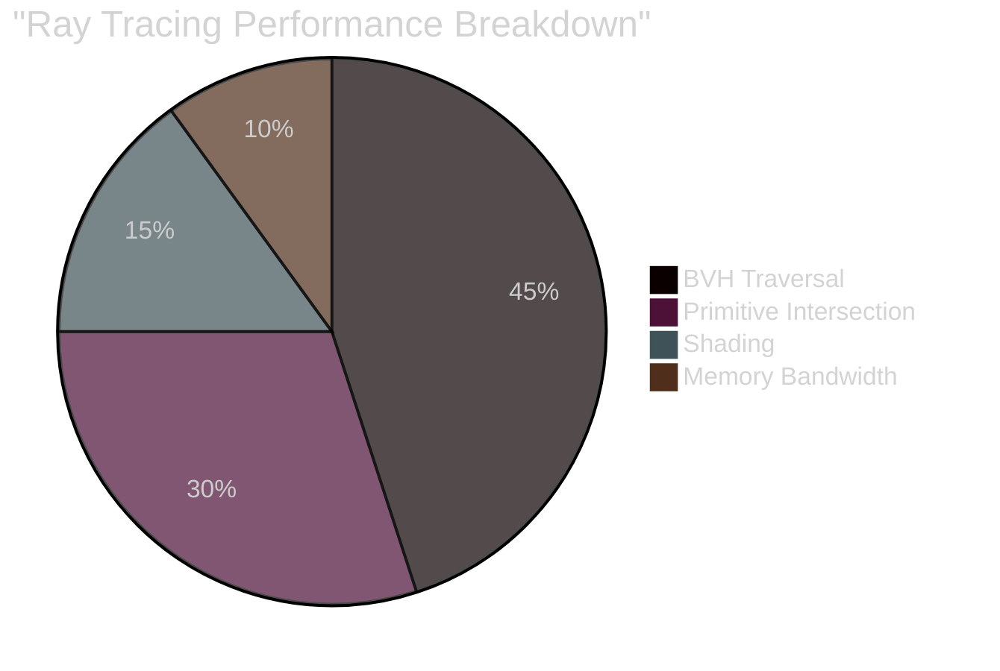
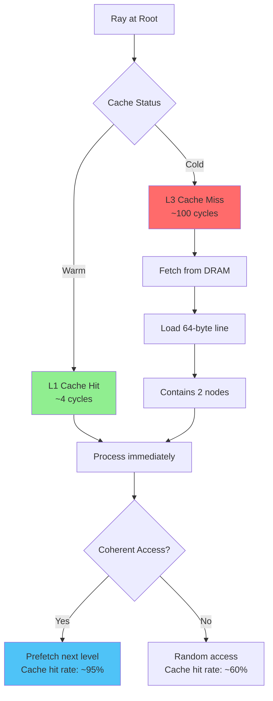
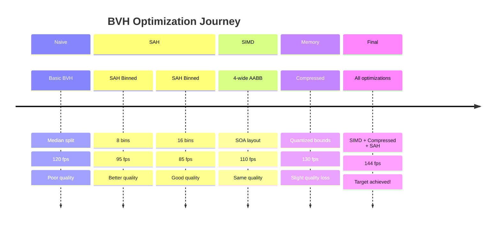
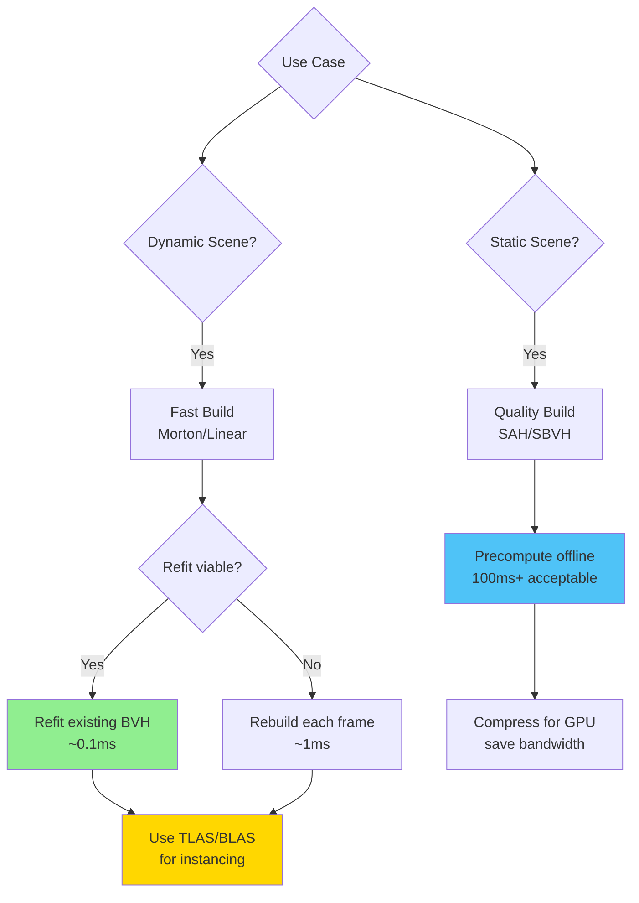

# Performance Analysis

Performance benchmarks and optimization insights for ray tracing acceleration structures.

## BVH Construction Performance

The choice of BVH construction algorithm significantly impacts both build time and traversal performance.

## Traversal Performance Comparison

Different acceleration structures have distinct performance characteristics.

## SAH Split Evaluation Flow

Surface Area Heuristic determines optimal split positions during BVH construction.

## Memory Layout Impact

Data structure layout has massive impact on cache performance.

## Render Pipeline Integration

How BVH fits into the complete ray tracing pipeline.

## Performance Metrics

### Typical Numbers (RTX 4090, 1M triangles)

| Metric | Value | Notes |
|--------|-------|-------|
| BVH Build | 10-15ms | SAH binned, 16 bins |
| BVH Nodes | ~2M nodes | 2N-1 for N primitives |
| Memory | ~64 MB | 32 bytes/node |
| Traversal | 15-25 steps | Average ray depth |
| Throughput | 2-4 Grays/s | Scene dependent |

### Optimization Impact

## Cache Behavior

Understanding cache patterns is critical for performance.

## Real-World Optimization Example

## Recommendations

## Related Topics

- [AABB](/interesting/aabb) - Core bounding primitive
- [BVH](/interesting/bvh) - Full construction details
- [Bounding Spheres](/interesting/bounding-spheres) - Alternative bounds
